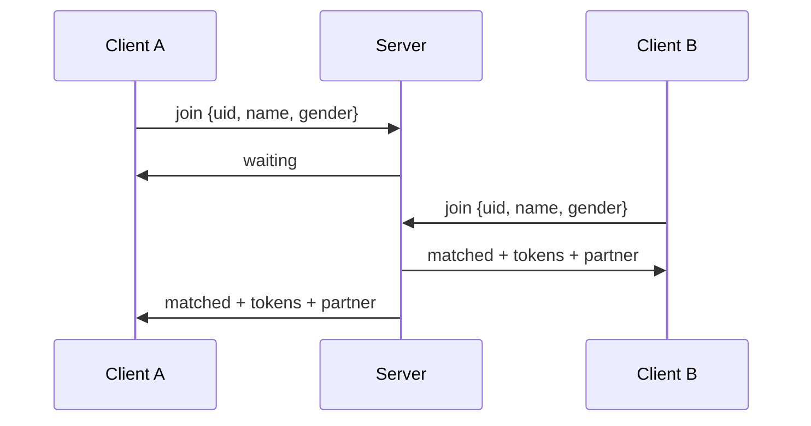
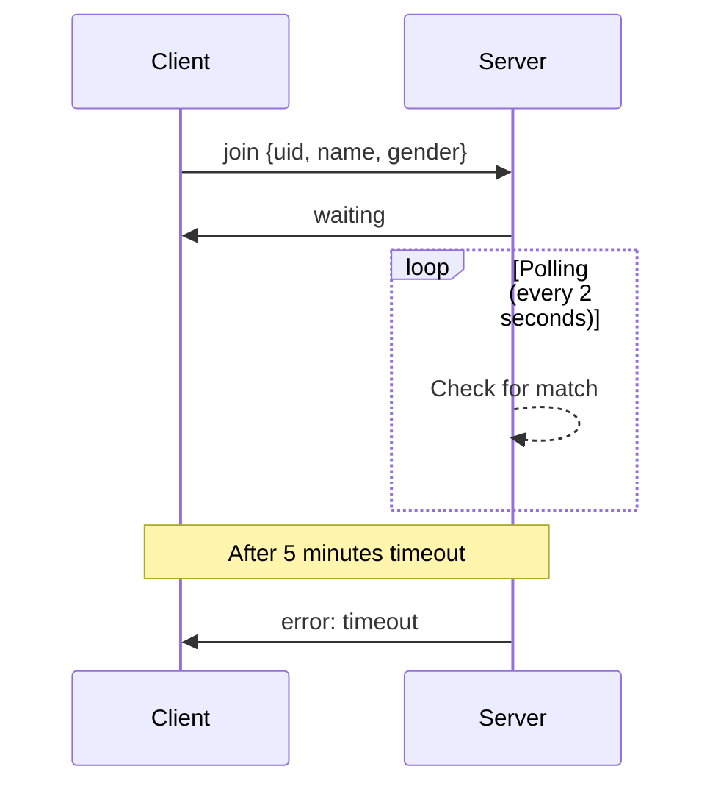
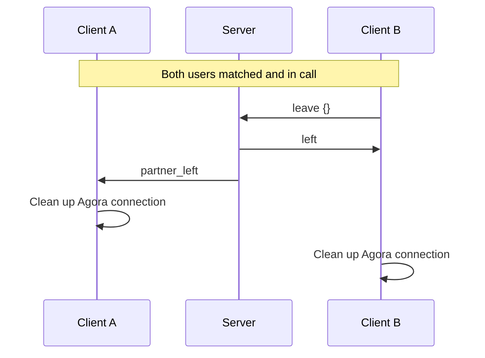

# Omeagle VITAP Backend API Documentation

Real-time WebSocket-based matchmaking API for video chat application with Agora integration.

## Table of Contents
- [Overview](#overview)
- [Quick Start](#quick-start)
- [Base URL](#base-url)
- [Authentication](#authentication)
- [WebSocket API](#websocket-api)
  - [Connection](#connection)
  - [Message Types](#message-types)
  - [Message Flow](#message-flow)
- [REST Endpoints](#rest-endpoints)
  - [Health Check](#health-check)
- [Error Handling](#error-handling)
- [Rate Limiting](#rate-limiting)
- [Integration Guide](#integration-guide)
- [Best Practices](#best-practices)

---

## Overview

The Omeagle VITAP backend provides a real-time matchmaking system for random video chat connections. Users are matched based on gender preferences, and each match creates a unique video/audio room using Agora RTC (Real-Time Communication) and RTM (Real-Time Messaging).

**Key Features:**
- Real-time WebSocket-based matchmaking
- Random matching (single queue for all users)
- Automatic token generation for Agora RTC + RTM
- Redis-powered queue system
- Active room management with TTL
- Automatic cleanup on disconnect

---

## Quick Start

### Connect in 3 Steps

**1. Get Your API Key**
```bash
# From your .env file
API_KEY=your-api-key-here
```

**2. Establish WebSocket Connection**
```javascript
// Browser (query parameter method)
const ws = new WebSocket('ws://localhost:8080/ws/match?apiKey=YOUR_API_KEY');

// Node.js or Postman (header method - more secure)
// URL: ws://localhost:8080/ws/match
// Header: X-API-Key: YOUR_API_KEY
```

**3. Join Matchmaking Queue**
```javascript
ws.onopen = () => {
  ws.send(JSON.stringify({
    type: 'join',
    data: {
      uid: 'user_12345',
      name: 'John Doe',
      gender: 'male'  // optional, not used for matching
    }
  }));
};

ws.onmessage = (event) => {
  const message = JSON.parse(event.data);
  
  if (message.data.status === 'matched') {
    console.log('Match found!', message.data);
    // You now have: roomId, channelName, rtcToken, rtmToken, partner info
  }
};
```

**That's it!** You're connected and ready to use Agora tokens for video/audio chat.

---

## Base URL

### Development
```
WebSocket: ws://localhost:8080/ws/match
HTTP: http://localhost:8080
```

### Production
```
WebSocket: wss://your-domain.com/ws/match
HTTP: https://your-domain.com
```

---

## Authentication

All WebSocket connections require **API Key authentication**. You can provide the API key in two ways:

1. **HTTP Header (Recommended)**: `X-API-Key` header
2. **Query Parameter (Backward Compatible)**: `apiKey` parameter

### Method 1: Header Authentication (Recommended)

Include the API key in the `X-API-Key` header when establishing the WebSocket connection.

**Example (JavaScript with Headers):**
```javascript
// Note: Browser WebSocket API doesn't support custom headers directly
// For browser, use query parameter method below
// For Node.js or environments supporting headers:
const ws = new WebSocket('ws://localhost:8080/ws/match', {
  headers: {
    'X-API-Key': 'your-api-key-here'
  }
});
```

**Example (Postman):**
1. Create new WebSocket request
2. URL: `ws://localhost:8080/ws/match`
3. Add header: `X-API-Key: your-api-key-here`

### Method 2: Query Parameter (Browser Compatible)

Include your API key in the WebSocket connection URL:

```
ws://localhost:8080/ws/match?apiKey=your-api-key-here
```

**Example (JavaScript - Browser):**
```javascript
const apiKey = 'your-api-key-here';
const ws = new WebSocket(`ws://localhost:8080/ws/match?apiKey=${apiKey}`);
```

### Error Responses

**Missing API Key (401 Unauthorized)**
```json
{
  "error": "API key required in X-API-Key header or apiKey query parameter"
}
```

**Invalid API Key (401 Unauthorized)**
```json
{
  "error": "Invalid API key"
}
```

### Security Best Practices

- **Use HTTPS/WSS in production** to encrypt API keys in transit
- **Use header authentication** when possible (more secure than URL parameters)
- **Never expose API keys** in client-side code repositories
- **Rotate API keys** regularly
- **Use environment variables** to store API keys

---

## WebSocket API

### Connection

**Endpoint:** `/ws/match`

**Protocol:** WebSocket (RFC 6455)

**Authentication:** API key via `X-API-Key` header or `apiKey` query parameter

**Example Connection (Browser):**
```javascript
// Browser WebSocket API doesn't support custom headers
// Use query parameter method
const ws = new WebSocket('ws://localhost:8080/ws/match?apiKey=YOUR_API_KEY');

ws.onopen = () => {
    console.log('Connected to matchmaking server');
};

ws.onmessage = (event) => {
    const message = JSON.parse(event.data);
    console.log('Received:', message);
};

ws.onerror = (error) => {
    console.error('WebSocket error:', error);
};

ws.onclose = () => {
    console.log('Disconnected from server');
};
```

---

### Message Types

All messages are JSON-formatted.

#### 1. Join Queue

Join the matchmaking queue to find a random partner.

**Client → Server:**
```json
{
  "type": "join",
  "data": {
    "uid": "user_12345",
    "name": "John Doe",
    "gender": "male"
  }
}
```

**Fields:**
- `type` (string, required): Must be "join"
- `uid` (string, required): Unique user identifier
- `name` (string, required): User's display name
- `gender` (string, optional): User's gender (stored but not used for matching)

**Server → Client (Waiting):**
```json
{
  "type": "response",
  "data": {
    "status": "waiting",
    "message": "Searching for a match..."
  }
}
```

**Server → Client (Matched):**
```json
{
  "type": "response",
  "data": {
    "status": "matched",
    "roomId": "room_abc123xyz",
    "channelName": "channel_abc123xyz",
    "rtcToken": "007eJxTYBBbsMMnKq3xzKmXL...",
    "rtmToken": "007eJxTYLCwMDMzNjA3NjY2...",
    "partner": {
      "uid": "user_67890",
      "name": "Jane Smith",
      "gender": "female"
    }
  }
}
```

**Fields:**
- `status` (string): "matched"
- `roomId` (string): Unique room identifier
- `channelName` (string): Agora channel name
- `rtcToken` (string): Agora RTC token (for video/audio)
- `rtmToken` (string): Agora RTM token (for text chat)
- `partner` (object): Partner's information

#### 2. Leave Room

Leave the current room and disconnect from partner.

**Client → Server:**
```json
{
  "type": "leave",
  "data": {}
}
```

**Server → Client (Success):**
```json
{
  "type": "response",
  "data": {
    "status": "left",
    "message": "You left the room"
  }
}
```

**Server → Partner (Notification):**
```json
{
  "type": "response",
  "data": {
    "status": "partner_left",
    "message": "Your partner left the room"
  }
}
```

#### 3. Cancel Search

Cancel matchmaking search while waiting in queue.

**Client → Server:**
```json
{
  "type": "cancel",
  "data": {
    "uid": "user_12345",
    "gender": "male"
  }
}
```

**Fields:**
- `type` (string, required): Must be "cancel"
- `uid` (string, required): User's unique identifier
- `gender` (string, required): User's gender (for queue lookup)

**Server → Client (Success):**
```json
{
  "type": "response",
  "data": {
    "status": "cancelled",
    "message": "Search cancelled successfully"
  }
}
```

**Use Cases:**
- User clicks "Stop" button while waiting
- User navigates away from search screen
- User wants to change search preferences

#### 4. Ping

Keep the connection alive (optional, WebSocket has built-in ping/pong).

**Client → Server:**
```json
{
  "type": "ping",
  "data": {}
}
```

**Server → Client:**
```json
{
  "type": "response",
  "data": {
    "status": "pong",
    "message": "Connection alive"
  }
}
```

#### 5. Error

Error messages from server.

**Server → Client:**
```json
{
  "type": "response",
  "data": {
    "status": "error",
    "message": "Error description here"
  }
}
```

---

### Message Flow

#### Scenario 1: Immediate Match



#### Scenario 2: Queue Wait



#### Scenario 3: Partner Leaves



---

## REST Endpoints

### Health Check

Check if the server is running.

**Endpoint:** `GET /health`

**Authentication:** None required

**Request:**
```bash
curl http://localhost:8080/health
```

**Response (200 OK):**
```json
{
  "status": "healthy",
  "version": "1.0.0",
  "timestamp": "2024-11-21T10:30:00Z"
}
```

---

## Error Handling

### WebSocket Errors

All WebSocket errors are sent as JSON messages:

```json
{
  "type": "response",
  "data": {
    "status": "error",
    "message": "Detailed error message"
  }
}
```

**Common Errors:**

| Error Message | Cause | Solution |
|--------------|-------|----------|
| `Invalid message format` | Malformed JSON | Check JSON syntax |
| `Unknown message type` | Invalid `type` field | Use "join", "leave", or "ping" |
| `Missing required field: uid` | Missing field in data | Include all required fields |
| `User already in a room` | Trying to join while in room | Leave current room first |
| `No active room found` | Trying to leave without room | Join a room first |
| `Failed to find match` | Matchmaking timeout | Try again later |

### HTTP Errors

**401 Unauthorized:**
```json
{
  "error": "API key required in query parameter"
}
```

**500 Internal Server Error:**
```json
{
  "error": "Internal server error"
}
```

---

## Rate Limiting

The API implements IP-based rate limiting to prevent abuse:

### WebSocket Connections

- **Connection Rate**: 10 connection attempts per minute per IP
- **Max Burst**: 20 connections (allows brief spikes)
- **Algorithm**: Token bucket
- **Scope**: Applied per IP address

**Rate Limit Exceeded (429):**
```json
{
  "error": "Rate limit exceeded. Try again later."
}
```

---

## Integration Guide

### Frontend Integration (React/Next.js)

```javascript
import { useEffect, useRef, useState } from 'react';

function useMatchmaking(apiKey) {
  const ws = useRef(null);
  const [status, setStatus] = useState('disconnected');
  const [match, setMatch] = useState(null);

  useEffect(() => {
    // Connect to WebSocket
    ws.current = new WebSocket(`ws://localhost:8080/ws/match?apiKey=${apiKey}`);

    ws.current.onopen = () => {
      setStatus('connected');
    };

    ws.current.onmessage = (event) => {
      const message = JSON.parse(event.data);
      
      if (message.data.status === 'waiting') {
        setStatus('waiting');
      } else if (message.data.status === 'matched') {
        setStatus('matched');
        setMatch(message.data);
      } else if (message.data.status === 'partner_left') {
        setStatus('partner_left');
        setMatch(null);
      }
    };

    ws.current.onerror = (error) => {
      console.error('WebSocket error:', error);
      setStatus('error');
    };

    ws.current.onclose = () => {
      setStatus('disconnected');
    };

    return () => {
      if (ws.current) {
        ws.current.close();
      }
    };
  }, [apiKey]);

  const joinQueue = (uid, name, gender) => {
    if (ws.current && ws.current.readyState === WebSocket.OPEN) {
      ws.current.send(JSON.stringify({
        type: 'join',
        data: { uid, name, gender }
      }));
    }
  };

  const leaveRoom = () => {
    if (ws.current && ws.current.readyState === WebSocket.OPEN) {
      ws.current.send(JSON.stringify({
        type: 'leave',
        data: {}
      }));
    }
  };

  return { status, match, joinQueue, leaveRoom };
}

// Usage
function MatchmakingComponent() {
  const { status, match, joinQueue, leaveRoom } = useMatchmaking('YOUR_API_KEY');

  const handleFindMatch = () => {
    joinQueue('user_123', 'John Doe', 'male');
  };

  return (
    <div>
      <p>Status: {status}</p>
      {status === 'connected' && (
        <button onClick={handleFindMatch}>Find Match</button>
      )}
      {status === 'matched' && match && (
        <div>
          <h3>Matched with {match.partner.name}!</h3>
          <p>Room: {match.roomId}</p>
          <button onClick={leaveRoom}>Leave Room</button>
        </div>
      )}
    </div>
  );
}
```

### Agora Integration

Once matched, use the provided tokens to initialize Agora SDK:

```javascript
import AgoraRTC from 'agora-rtc-sdk-ng';
import AgoraRTM from 'agora-rtm-sdk';

// Initialize RTC (Video/Audio)
const rtcClient = AgoraRTC.createClient({ mode: 'rtc', codec: 'vp8' });

async function joinVideoCall(match) {
  await rtcClient.join(
    'YOUR_AGORA_APP_ID',
    match.channelName,
    match.rtcToken,
    match.partner.uid
  );

  // Publish local audio and video
  const audioTrack = await AgoraRTC.createMicrophoneAudioTrack();
  const videoTrack = await AgoraRTC.createCameraVideoTrack();
  await rtcClient.publish([audioTrack, videoTrack]);
}

// Initialize RTM (Text Chat)
const rtmClient = new AgoraRTM.createInstance('YOUR_AGORA_APP_ID');

async function joinTextChat(match) {
  await rtmClient.login({
    token: match.rtmToken,
    uid: match.partner.uid
  });

  const channel = rtmClient.createChannel(match.channelName);
  await channel.join();

  // Send text message
  channel.sendMessage({ text: 'Hello!' });

  // Receive messages
  channel.on('ChannelMessage', (message, memberId) => {
    console.log(`${memberId}: ${message.text}`);
  });
}
```

---

## Best Practices

### 1. Connection Management

- Implement automatic reconnection with exponential backoff
- Handle connection errors gracefully
- Close WebSocket when component unmounts

```javascript
let reconnectAttempts = 0;
const maxReconnectAttempts = 5;

function reconnect() {
  if (reconnectAttempts < maxReconnectAttempts) {
    const delay = Math.min(1000 * Math.pow(2, reconnectAttempts), 30000);
    setTimeout(connect, delay);
    reconnectAttempts++;
  }
}
```

### 2. Message Validation

- Always validate incoming messages before processing
- Check for required fields
- Handle unexpected message types

```javascript
function isValidMessage(message) {
  return message && 
         message.type && 
         message.data && 
         typeof message.data === 'object';
}
```

### 3. User Experience

- Show loading states while waiting for match
- Display timeout warnings before 5-minute limit
- Notify users when partner disconnects
- Implement "Next" button to quickly find new matches

### 4. Security

- Never expose API keys in client-side code (use environment variables)
- Validate user input before sending
- Implement user authentication in your frontend
- Use HTTPS/WSS in production

### 5. Error Handling

- Implement comprehensive error handling
- Show user-friendly error messages
- Log errors for debugging
- Implement fallback mechanisms

### 6. Performance

- Reuse WebSocket connections when possible
- Debounce user actions (e.g., rapid join/leave)
- Clean up Agora resources when leaving room
- Monitor connection quality

### 7. Testing

- Test with different network conditions
- Simulate partner disconnections
- Test timeout scenarios
- Verify token expiration handling

---

## Example Workflow

**Complete User Journey:**

```javascript
// 1. Connect to WebSocket
const ws = new WebSocket('ws://localhost:8080/ws/match?apiKey=YOUR_API_KEY');

// 2. Wait for connection
ws.onopen = () => {
  console.log('Connected!');
};

// 3. Join matchmaking queue
ws.send(JSON.stringify({
  type: 'join',
  data: {
    uid: 'user_123',
    name: 'John Doe',
    gender: 'male'
  }
}));

// 4. Receive match notification
ws.onmessage = (event) => {
  const message = JSON.parse(event.data);
  
  if (message.data.status === 'matched') {
    const { channelName, rtcToken, rtmToken, partner } = message.data;
    
    // 5. Initialize Agora with tokens
    initializeAgora(channelName, rtcToken, rtmToken);
    
    // 6. Start video call
    console.log(`Matched with ${partner.name}!`);
  }
};

// 7. Leave when done
ws.send(JSON.stringify({
  type: 'leave',
  data: {}
}));

// 8. Close connection
ws.close();
```

---

## Support

For issues or questions:
- GitHub: https://github.com/rudra-sah00/omeagle-vitap-backend
- Documentation: See TESTING.md for detailed testing guide
- Architecture: See ARCHITECTURE.md for system design

---

## Version History

- **v1.0.0** - Initial WebSocket-based matchmaking release
- Gender-based queue system
- Agora RTC + RTM token generation
- Redis-powered queue and room management
