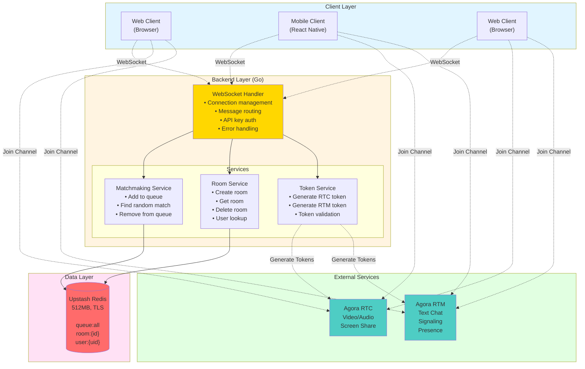
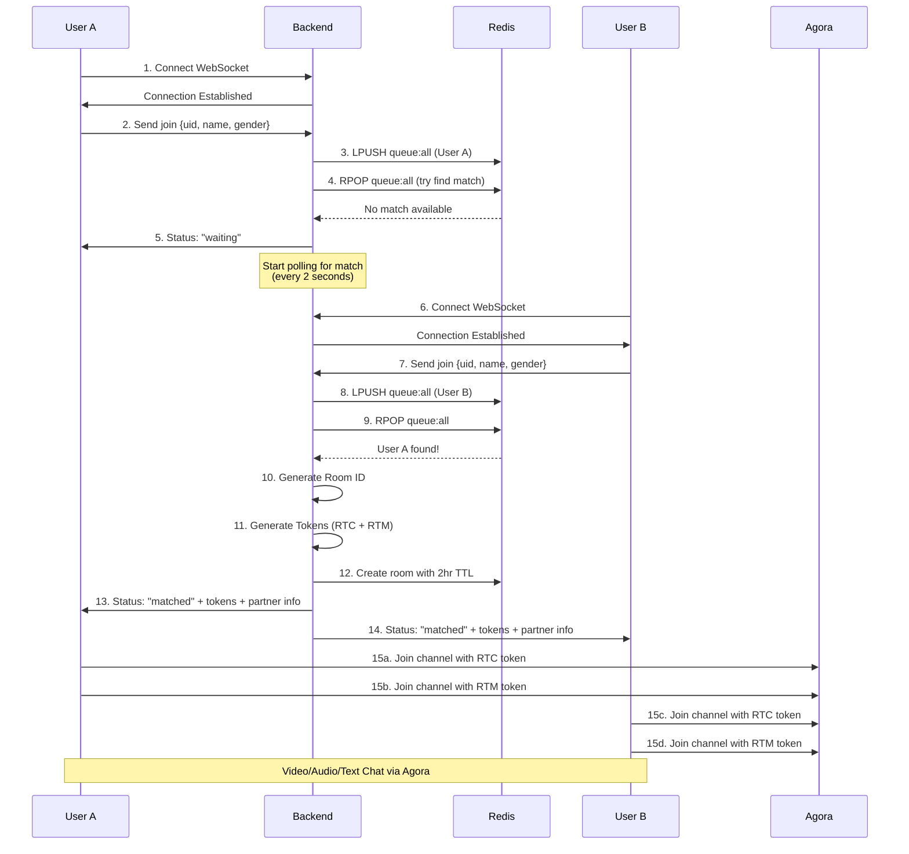
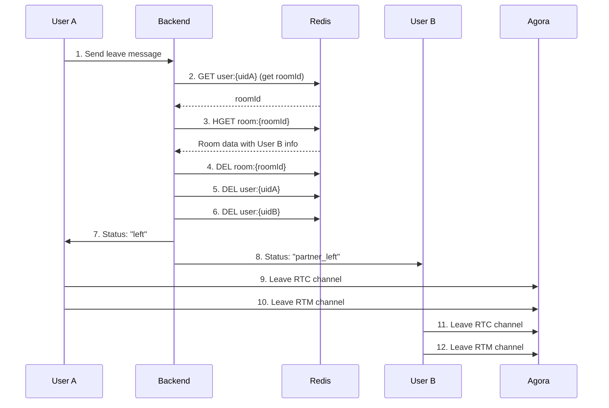
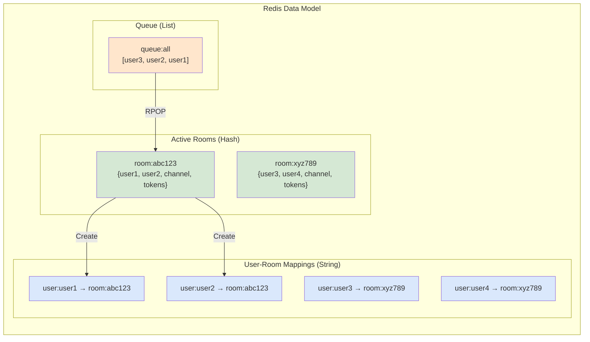
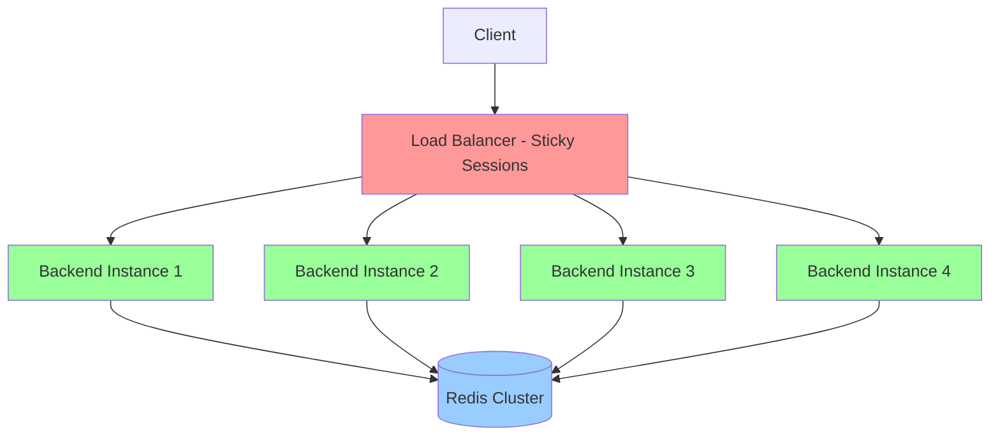

# Omeagle VITAP Backend Architecture

Comprehensive technical documentation for the WebSocket-based matchmaking system.

## Table of Contents
- [System Overview](#system-overview)
- [Architecture Diagram](#architecture-diagram)
- [Core Components](#core-components)
- [Data Flow](#data-flow)
- [Technology Stack](#technology-stack)
- [Redis Design](#redis-design)
- [Agora Integration](#agora-integration)
- [Scalability](#scalability)
- [Security](#security)
- [Performance](#performance)

---

## System Overview

The Omeagle VITAP backend is a real-time matchmaking system that connects random strangers for video chat. The system uses WebSocket for persistent connections, Redis for queue management, and Agora for video/audio/text communication.

**Key Design Principles:**
- **Real-time**: WebSocket for instant bidirectional communication
- **Stateless**: All state stored in Redis for horizontal scaling
- **Random matching**: Single queue for all users (FIFO - first in, first out)
- **Automatic cleanup**: TTL-based expiration and disconnect handling
- **Token security**: Dynamic Agora token generation per session

---

## Architecture Diagram



---

## Core Components

### 1. WebSocket Handler (`src/handlers/websocket/handler.go`)

**Responsibilities:**
- Accept WebSocket connections with API key validation
- Parse incoming messages (join, leave, ping)
- Route messages to appropriate services
- Send responses back to clients
- Handle connection lifecycle (open, close, error)

**Key Methods:**
- `HandleWebSocketWithAuth()` - API key authentication wrapper
- `HandleWebSocket()` - Main WebSocket connection handler
- `handleJoin()` - Process join requests and matchmaking
- `handleLeave()` - Process leave requests and cleanup
- `pollForMatch()` - Background polling for match (2s interval, 5min timeout)
- `createAndNotifyMatch()` - Generate tokens and notify both users

**Connection Flow:**
```go
1. Client connects with API key
2. Validate API key
3. Upgrade HTTP to WebSocket
4. Start message loop
5. Read messages → Parse → Route
6. On close: cleanup resources
```

### 2. Matchmaking Service (`src/services/matchmaking/service.go`)

**Responsibilities:**
- Manage single matchmaking queue in Redis
- Find random matches between users (FIFO)
- Generate unique room IDs
- Queue operations (add, remove, find)

**Key Methods:**
- `AddToQueue(queueUser)` - Add user to gender-specific queue
- `FindMatch(gender)` - Find opposite gender user
- `RemoveFromQueue(uid, gender)` - Remove user from queue
- `GenerateRoomID()` - Create unique room identifier

**Queue Design:**
```
Redis Keys:
- queue:all → List (FIFO queue)

Data Structure:
{
  "uid": "user_12345",
  "name": "John Doe",
  "gender": "male",  // stored but not used for matching
  "joinedAt": 1732000000
}

Matching Strategy:
- LPUSH: Add new user to front of queue
- RPOP: Remove oldest user from back of queue
- First in, first matched
```

### 3. Room Service (`src/services/room/service.go`)

**Responsibilities:**
- Create and manage active video rooms
- Track room participants
- User-room mapping for quick lookups
- Automatic cleanup with TTL

**Key Methods:**
- `CreateRoom(room)` - Create new room with 2-hour TTL
- `GetRoom(roomID)` - Retrieve room details
- `DeleteRoom(roomID)` - Remove room and mappings
- `RemoveUserFromRoom(uid)` - Remove user from their room
- `IsUserInRoom(uid)` - Check if user has active room

**Room Structure:**
```go
type Room struct {
    RoomID      string    `json:"roomId"`
    ChannelName string    `json:"channelName"`
    User1       User      `json:"user1"`
    User2       User      `json:"user2"`
    CreatedAt   time.Time `json:"createdAt"`
    ExpiresAt   time.Time `json:"expiresAt"`
}

// Redis Keys:
// room:{roomId} → Room JSON
// user:{uid} → roomId
// TTL: 2 hours (7200 seconds)
```

### 4. Token Service (`src/services/token/service.go`)

**Responsibilities:**
- Generate Agora RTC tokens for video/audio
- Generate Agora RTM tokens for text chat
- Token expiration management

**Key Methods:**
- `GenerateRTCToken(channelName, uid, role, expiryTime)` - RTC token
- `GenerateRTMToken(userID, expiryTime)` - RTM token
- `GenerateBothTokens(channelName, uid, expiryTime)` - Convenience method

**Token Details:**
```go
// RTC Token (Video/Audio)
- AppID: From environment
- AppCertificate: From environment
- ChannelName: Unique per room
- UID: User identifier (uint32)
- Role: Publisher (can send/receive)
- Expiry: 3600 seconds (1 hour)

// RTM Token (Text Chat)
- AppID: From environment
- AppCertificate: From environment
- UserID: String identifier
- Expiry: 3600 seconds (1 hour)
```

### 5. Redis Client (`src/config/redis/client.go`)

**Responsibilities:**
- Initialize connection to Upstash Redis
- Configure TLS for secure connection
- Connection pooling and health checks

**Configuration:**
```go
// Upstash Redis
URL: https://diverse-crayfish-13921.upstash.io
Port: 6379
TLS: Required
Token: ATZhAAIncDI2YTZjOWJhMTgzMGQ0ZDlhOTUwYmFmOTdiNTY4NTJhOXAyMTM5MjE
Max Retries: 3
Pool Size: 10
```

---

## Data Flow

### Matchmaking Flow



### Leave Flow



---

## Technology Stack

### Backend
- **Go 1.24.0** - High-performance, concurrent language
- **Gin Framework** - Fast HTTP web framework
- **gorilla/websocket v1.5.3** - WebSocket implementation

### Data Storage
- **Redis (Upstash)** - In-memory data store
  - Queue management
  - Room tracking
  - User-room mappings
  - TTL-based expiration

### External Services
- **Agora RTC** - Video/audio communication
  - 10,000 minutes/month included in Agora free plan
  - HD quality video
  - Low latency (<400ms globally)
  - Note: All users get same features (no premium tiers)
  
- **Agora RTM** - Real-time messaging
  - Pricing: $3 per million messages
  - First million messages free per month
  - ~$1.50/month for 1.5M messages (500k additional)
  - Note: All users get same features (no premium tiers)

### Development Tools
- **Docker** - Containerization
- **Make** - Build automation
- **Air** - Hot reload for development
- **golangci-lint** - Code linting

---

## Redis Design

### Data Structures

#### 1. Queue Data (List)

```redis
# Single queue for all users
LPUSH queue:all '{"uid":"user1","name":"John","gender":"male","joinedAt":1732000000}'
LPUSH queue:all '{"uid":"user2","name":"Mike","gender":"male","joinedAt":1732000001}'
LPUSH queue:all '{"uid":"user3","name":"Jane","gender":"female","joinedAt":1732000002}'

# Why Redis List?
- FIFO queue (First In, First Out)
- O(1) insertion at head (LPUSH)
- O(1) removal from tail (RPOP)
- Simple and fast random matching
- Can implement complex matching later
```

**Visual Representation:**



#### 2. Room Data (Hashes with TTL)

```redis
# Room details
HSET room:abc123 data '{"roomId":"abc123","channelName":"ch_abc123","user1":{...},"user2":{...}}'
EXPIRE room:abc123 7200  # 2 hours

# Why hashes?
- Single atomic operation
- Efficient storage
- Automatic TTL cleanup
```

#### 3. User-Room Mapping (Strings with TTL)

```redis
# Map user to room
SET user:user1 abc123 EX 7200
SET user:user2 abc123 EX 7200

# Why strings with TTL?
- Fast O(1) lookup
- Automatic cleanup
- Simple data model
```

### Memory Usage

**Estimated storage per user in queue:**
```
User data: ~100 bytes
Queue overhead: ~50 bytes
Total: ~150 bytes per queued user
```

**Estimated storage per active room:**
```
Room data: ~500 bytes
User mappings: ~100 bytes × 2
Total: ~700 bytes per room
```

**Capacity (512MB Redis):**
```
Queue: ~3.5 million users
Rooms: ~750,000 concurrent rooms
Realistic usage: 10,000 concurrent rooms = ~7MB
```

### Redis Commands Used

```redis
# Queue operations
LPUSH queue:all MEMBER             # Add to front of queue
RPOP queue:all                     # Remove from back of queue (oldest)
LRANGE queue:all 0 -1              # Get all queue members
LREM queue:all 1 MEMBER            # Remove specific member
LLEN queue:all                     # Get queue size

# Room operations
HSET room:ID field value           # Create room
HGET room:ID field                 # Get room data
DEL room:ID                        # Delete room
EXPIRE room:ID 7200                # Set TTL

# User mapping
SET user:ID roomID EX 7200         # Map user to room
GET user:ID                        # Get user's room
DEL user:ID                        # Remove mapping

# Monitoring (development)
LRANGE queue:all 0 -1              # View all queued users
KEYS room:*                        # List all rooms
KEYS user:*                        # List all users
FLUSHALL                           # Clear all data
```

---

## Agora Integration

### RTC (Video/Audio)

**Features:**
- HD video (up to 1080p)
- High-quality audio
- Screen sharing
- Multiple codec support (VP8, H.264)
- Low latency (<400ms)

**Token Generation:**
```go
token, err := rtctokenbuilder.BuildTokenWithUID(
    appID,
    appCertificate,
    channelName,
    uid,
    rtctokenbuilder.RolePublisher,  // Can send and receive
    expiryTime,
)
```

**Client Usage (JavaScript):**
```javascript
const client = AgoraRTC.createClient({ mode: 'rtc', codec: 'vp8' });
await client.join(appID, channelName, rtcToken, uid);

const audioTrack = await AgoraRTC.createMicrophoneAudioTrack();
const videoTrack = await AgoraRTC.createCameraVideoTrack();
await client.publish([audioTrack, videoTrack]);
```

### RTM (Text Chat)

**Features:**
- Peer-to-peer messages
- Channel messages
- Presence detection
- Message history
- Typing indicators

**Token Generation:**
```go
token, err := rtmtokenbuilder.BuildToken(
    appID,
    appCertificate,
    userID,
    expiryTime,
    "",  // streamName (empty for user login)
)
```

**Client Usage (JavaScript):**
```javascript
const client = AgoraRTM.createInstance(appID);
await client.login({ token: rtmToken, uid: userID });

const channel = client.createChannel(channelName);
await channel.join();

// Send message
await channel.sendMessage({ text: 'Hello!' });

// Receive messages
channel.on('ChannelMessage', (message, memberId) => {
    console.log(`${memberId}: ${message.text}`);
});
```

---

## Scalability

### Horizontal Scaling

**Current Architecture:**
- Stateless backend (all state in Redis)
- Can add multiple backend instances
- Load balancer distributes WebSocket connections
- Redis handles synchronization

**Scaling Strategy:**



**Load Balancer Configuration:**
- Sticky sessions based on IP (WebSocket requirement)
- Health checks on `/health` endpoint
- WebSocket upgrade support
- TLS termination

### Vertical Scaling

**Backend:**
- Go handles 10,000+ concurrent WebSocket connections per instance
- CPU: 2-4 cores sufficient for 10k connections
- Memory: 2-4GB for 10k connections
- Network: 1Gbps for 10k connections

**Redis:**
- Current: 512MB Upstash (10k concurrent rooms)
- Scale to: 2GB (40k concurrent rooms)
- Scale to: 8GB (160k concurrent rooms)

### Performance Metrics

**Expected Performance:**
```
Single Backend Instance:
- 10,000 concurrent WebSocket connections
- 5,000 concurrent rooms (matches)
- 100 matches/second
- <50ms message latency

Redis:
- 100,000+ ops/second
- <1ms read/write latency
- ~7MB for 10k rooms
```

---

## Security

### 1. API Key Authentication

```go
// Query parameter validation
apiKey := c.Query("apiKey")
if apiKey != expectedKey {
    return UnauthorizedError
}
```

**Best Practices:**
- API key in environment variable
- Never commit to version control
- Rotate keys regularly
- Different keys for dev/prod

### 2. Input Validation

```go
// Validate all user inputs
func validateJoinRequest(req MatchRequest) error {
    if req.UID == "" {
        return errors.New("uid required")
    }
    if req.Gender != "male" && req.Gender != "female" {
        return errors.New("invalid gender")
    }
    // ... more validation
}
```

### 3. Rate Limiting

```go
// IP-based rate limiting
rateLimit := 60 requests/minute
burst := 100 requests
algorithm := TokenBucket
```

### 4. CORS

```go
// Restrict origins in production
allowedOrigins := []string{
    "https://yourdomain.com",
    "https://app.yourdomain.com",
}
```

### 5. TLS/SSL

```go
// Production requirements
- HTTPS for HTTP endpoints
- WSS for WebSocket connections
- TLS 1.2+ only
- Strong cipher suites
```

### 6. Token Security

```go
// Agora tokens expire
expiryTime := 3600 seconds  // 1 hour
// After expiry, user must reconnect
// New tokens generated for each match
```

---

## Performance

### WebSocket Performance

**Connection Overhead:**
- Initial handshake: ~100ms
- Message send: <10ms
- Message receive: <10ms
- Connection memory: ~200KB per connection

**Optimization:**
```go
// Use connection pools
websocket.Upgrader{
    ReadBufferSize:  1024,
    WriteBufferSize: 1024,
}

// Reuse goroutines
// Close connections gracefully
```

### Redis Performance

**Operation Latency:**
- ZADD (queue add): <1ms
- ZRANGE (queue read): <1ms
- HSET (room create): <1ms
- HGET (room read): <1ms

**Connection Pooling:**
```go
redis.NewClient(&redis.Options{
    PoolSize:     10,
    MinIdleConns: 5,
    MaxRetries:   3,
})
```

### Matchmaking Performance

**Best Case (Immediate Match):**
```
User joins → Check opposite queue → Match found → Create room
Total time: ~50ms
```

**Worst Case (No Match):**
```
User joins → Poll every 2s → 5 min timeout
Polling overhead: ~25ms per check
Maximum wait: 5 minutes
```

**Optimization:**
- Background polling in goroutine
- Efficient queue queries
- Early timeout detection

---

## Monitoring

### Key Metrics

```go
// Application metrics
- Active WebSocket connections
- Queue sizes (male/female)
- Active rooms count
- Match rate (matches/minute)
- Average wait time
- Error rate

// Redis metrics
- Memory usage
- Operations per second
- Connection count
- Hit rate

// Agora metrics
- Active channels
- API call rate
- Token generation rate
```

### Health Checks

```go
// Health endpoint
GET /health

Response:
{
    "status": "healthy",
    "redis": "connected",
    "websocket": "active",
    "version": "1.0.0"
}
```

---

## Future Enhancements

### 1. Geographic Matching

```go
// Match users by region
- Reduce latency
- Better video quality
- Language preferences
```

### 2. Interest-Based Matching

```go
// Add interests to match request
- Common hobbies
- Topic preferences
- Age groups
```

### 3. Report System

```go
// User reporting
- Inappropriate behavior
- Automated bans
- Moderation dashboard
```

### 4. Analytics

```go
// Usage analytics
- Peak hours
- Average session duration
- Geographic distribution
- Gender ratios
```

---

## Conclusion

The Omeagle VITAP backend is designed for:
- **Real-time performance** with WebSocket
- **Horizontal scalability** with stateless design
- **Cost efficiency** with Redis and Agora free tiers
- **Security** with API key auth and input validation
- **Reliability** with automatic cleanup and TTLs
- **Simplicity** with no premium features or payment systems

Total cost: **~$2-3/month** for 10k daily active users (all features free for all users).
