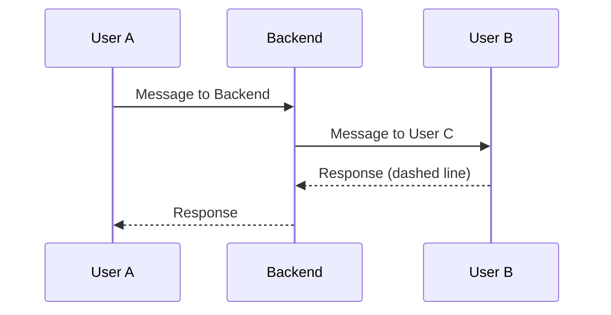
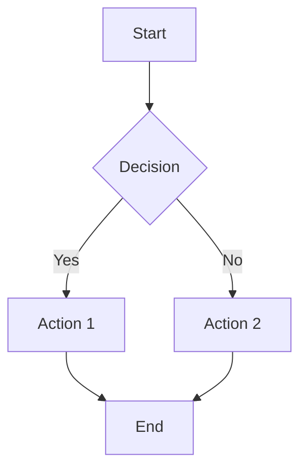
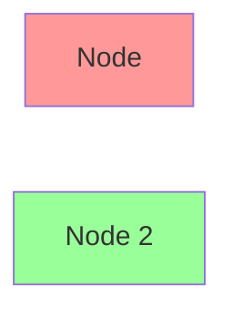
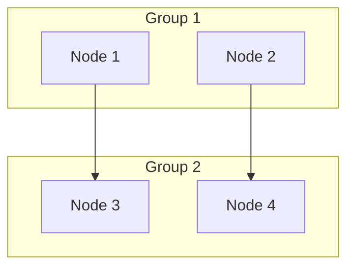

# Documentation Diagrams Guide

This guide explains the Mermaid diagrams used throughout the documentation.

## Overview

The documentation now uses [Mermaid](https://mermaid.js.org/) diagrams for better visualization. Mermaid is supported natively by GitHub, GitLab, and many documentation platforms.

## Diagrams in Documentation

### 1. ARCHITECTURE.md

#### System Architecture Diagram
**Type:** Graph (flowchart)  
**Location:** Architecture Diagram section  
**Purpose:** Shows the complete system architecture with all layers and components

**Key Components:**
- Client Layer (Web/Mobile clients)
- Backend Layer (WebSocket Handler + Services)
- Data Layer (Redis)
- External Services (Agora RTC/RTM)

#### Matchmaking Sequence Diagram
**Type:** Sequence Diagram  
**Location:** Data Flow > Matchmaking Flow  
**Purpose:** Shows the step-by-step process of how two users get matched

**Flow:**
1. User A connects and joins queue
2. Server responds with "waiting" status
3. User B connects and joins queue
4. Server finds match and creates room
5. Server generates tokens
6. Both users receive match notification with tokens
7. Users connect to Agora for video/audio/text

#### Leave Flow Sequence Diagram
**Type:** Sequence Diagram  
**Location:** Data Flow > Leave Flow  
**Purpose:** Shows what happens when a user leaves a call

**Flow:**
1. User A sends leave message
2. Backend retrieves room info from Redis
3. Backend deletes room and user mappings
4. Backend notifies both users
5. Users disconnect from Agora

#### Horizontal Scaling Diagram
**Type:** Graph (flowchart)  
**Location:** Scalability > Horizontal Scaling  
**Purpose:** Shows how the system can scale horizontally with multiple backend instances

**Components:**
- Load Balancer (sticky IP for WebSocket)
- Multiple Backend Instances (stateless)
- Shared Redis Cluster

#### Redis Data Model Diagram
**Type:** Graph (flowchart)  
**Location:** Redis Design > Queue Data  
**Purpose:** Visualizes how data is stored in Redis

**Data Structures:**
- Queue (List): `queue:all`
- Rooms (Hash): `room:{id}`
- User Mappings (String): `user:{uid}`

---

### 2. API.md

#### Immediate Match Scenario
**Type:** Sequence Diagram  
**Location:** Message Flow > Scenario 1  
**Purpose:** Shows two users matching immediately

**Simple Flow:**
- Client A joins → waiting
- Client B joins → both matched instantly

#### Queue Wait Scenario
**Type:** Sequence Diagram  
**Location:** Message Flow > Scenario 2  
**Purpose:** Shows user waiting in queue with polling

**Flow:**
- Client joins queue
- Server polls every 2 seconds
- After 5 minutes → timeout error

#### Partner Leaves Scenario
**Type:** Sequence Diagram  
**Location:** Message Flow > Scenario 3  
**Purpose:** Shows what happens when partner disconnects

**Flow:**
- Both users in call
- Client B leaves
- Server notifies Client A
- Both clean up Agora connections

---

## Viewing Mermaid Diagrams

### On GitHub
Mermaid diagrams render automatically in:
- README.md files
- Documentation files
- Pull requests
- Issues

### In VS Code
Install the **Mermaid Preview** extension:
```bash
code --install-extension bierner.markdown-mermaid
```

Then use `Cmd+Shift+V` (Mac) or `Ctrl+Shift+V` (Windows/Linux) to preview.

### In Browser
Use the [Mermaid Live Editor](https://mermaid.live/):
1. Copy the mermaid code
2. Paste into the editor
3. View live preview

### In Documentation Sites
Most documentation generators support Mermaid:
- GitBook
- Docusaurus
- MkDocs (with plugin)
- Jekyll (with plugin)

---

## Diagram Color Coding

### ARCHITECTURE.md - System Architecture
- **Blue (#e1f5ff)**: Client Layer
- **Yellow (#fff4e1)**: Backend Layer
- **Pink (#ffe1f5)**: Data Layer
- **Green (#e1ffe1)**: External Services
- **Gold (#ffd700)**: WebSocket Handler (important)
- **Red (#ff6b6b)**: Redis (data store)
- **Teal (#4ecdc4)**: Agora Services

### ARCHITECTURE.md - Horizontal Scaling
- **Red (#ff9999)**: Load Balancer
- **Blue (#99ccff)**: Redis Cluster
- **Green (#99ff99)**: Backend Instances

### ARCHITECTURE.md - Redis Data Model
- **Orange (#ffe6cc)**: Queue (List)
- **Green (#d5e8d4)**: Rooms (Hash)
- **Blue (#dae8fc)**: User Mappings (String)

---

## Editing Mermaid Diagrams

### Basic Syntax

#### Sequence Diagram


#### Graph/Flowchart


#### Styling


### Common Patterns

#### Arrow Types (Sequence Diagrams)
- `A->>B`: Solid line with arrow
- `A-->>B`: Dashed line with arrow
- `A->B`: Solid line without arrow
- `A-->B`: Dashed line without arrow

#### Node Shapes (Graphs)
- `A[Rectangle]`
- `B(Rounded)`
- `C{Diamond}`
- `D[(Database)]`
- `E((Circle))`

#### Subgraphs


---

## Benefits of Mermaid Diagrams

1. **Version Control**: Diagrams are text-based, can be tracked in Git
2. **Auto-Rendering**: GitHub/GitLab render automatically
3. **Easy Updates**: Edit text instead of image editors
4. **Consistent Style**: Diagrams follow same style automatically
5. **Accessibility**: Screen readers can read diagram code
6. **No External Tools**: No need for draw.io, Visio, etc.
7. **Maintainable**: Easy to update when architecture changes

---

## Resources

- [Mermaid Documentation](https://mermaid.js.org/)
- [Mermaid Live Editor](https://mermaid.live/)
- [GitHub Mermaid Support](https://github.blog/2022-02-14-include-diagrams-markdown-files-mermaid/)
- [Mermaid Cheat Sheet](https://jojozhuang.github.io/tutorial/mermaid-cheat-sheet/)

---

## Quick Reference

### Most Used Diagram Types

1. **Sequence Diagram**: For message flows, API interactions
2. **Graph/Flowchart**: For architecture, process flows
3. **State Diagram**: For state machines (not used yet)
4. **Entity Relationship**: For database schemas (not used yet)
5. **Gantt Chart**: For project timelines (not used yet)

### Tips

- Keep diagrams simple and focused
- Use subgraphs for grouping related nodes
- Add notes for clarification
- Use consistent naming across diagrams
- Color code by function/layer
- Test rendering on GitHub before committing

---

## Contributing

When adding new diagrams:

1. Choose appropriate diagram type
2. Keep it simple and readable
3. Use consistent styling
4. Test on GitHub markdown preview
5. Add explanation in surrounding text
6. Use colors meaningfully
7. Keep diagram code in markdown file (not separate)

---

## Example: Adding a New Diagram

```markdown
### My New Feature

This diagram shows how the new feature works:

\`\`\`mermaid
sequenceDiagram
    participant User
    participant Backend
    participant Database
    
    User->>Backend: Request
    Backend->>Database: Query
    Database-->>Backend: Response
    Backend-->>User: Result
\`\`\`

**Explanation:**
- User makes request to backend
- Backend queries database
- Database returns data
- Backend sends result to user
```

---

## Maintenance

Update diagrams when:
- Architecture changes
- New services added
- Flow changes
- Data model changes
- Scaling strategy changes

Keep diagrams in sync with code!
